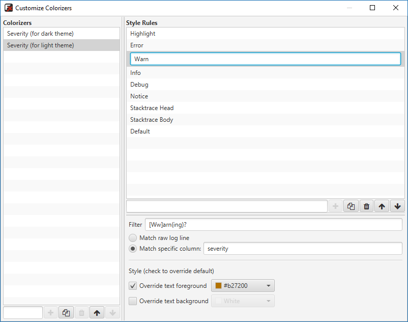

# FX Log

A clean and free log viewer.

## Download

You can find the executable Jar in the
[FX Log bintray repository](https://bintray.com/joffrey-bion/applications/fx-log/).

## What does it look like?

Wanna go dark?

## Features

### Tailing

FX Log follows the end of your file and streams in real time.

### Filtering

Show only the interesting logs at any time.

### Columnization

Use regular expressions to parse your raw log lines into nice columns:

Built-in support is already included for standard server logs.

### Colorization

Use regular expressions on raw log lines or column values to change the style of some logs:

## Contribute

In order to contribute, you will need [Gradle](http://gradle.org/gradle-download/) and at least JDK 8 u40.
You might also find the [Java FX Scene Builder](http://gluonhq.com/open-source/scene-builder/) pretty useful to edit
the views.

As mentioned in [this issue](https://github.com/joffrey-bion/fx-log/issues/6), when you first import the project, you
wont be able to run gradle directly because of some distribution-related user variables that you can define in a
`gradle.properties` file in the project:

    bintrayUsername: .
    bintrayApiKey: .
    bintrayRepoApps: .

If you have any better idea to solve this issue, please feel free to comment on the issue.